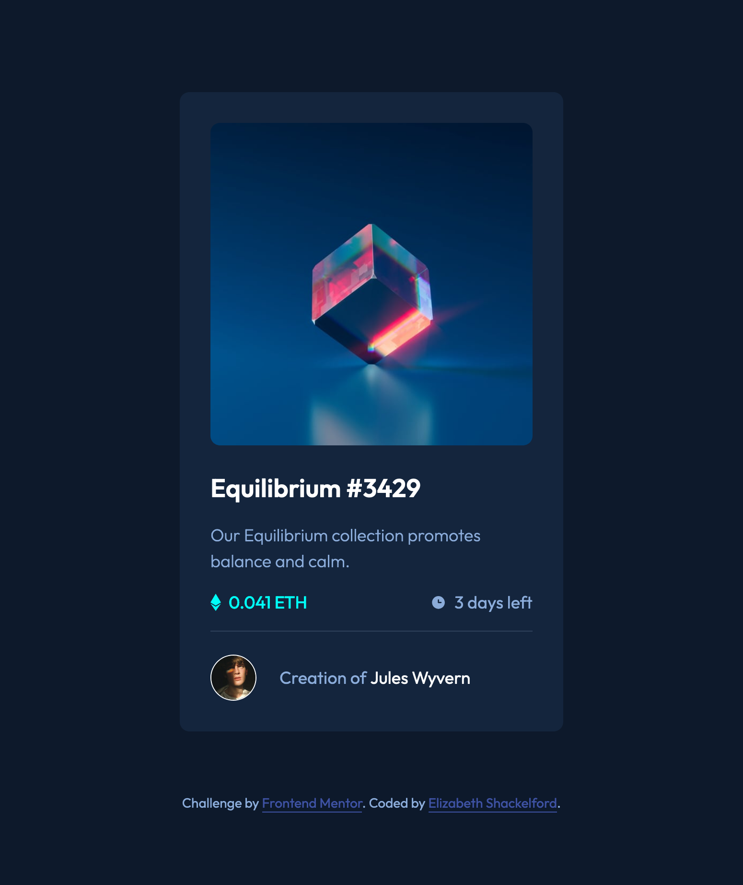

# Frontend Mentor - NFT Preview Card Component Solution

This is my solution to the [NFT preview card component challenge on Frontend Mentor](https://www.frontendmentor.io/challenges/nft-preview-card-component-SbdUL_w0U). These challenges help improve coding skills by building realistic, front-end projects.

## Table of contents

- [Overview](#overview)
  - [The challenge](#the-challenge)
  - [Screenshot](#screenshot)
  - [Links](#links)
- [My process](#my-process)
  - [Built with](#built-with)
  - [What I learned](#what-i-learned)
  - [Continued development](#continued-development)
- [Author](#author)

## Overview

### The challenge

This NFT preview card component challenge involves a responsive and interactive card component that adjusts seamlessly across screen sizes and incorporates hover effects to enhance user experience. The purpose of this project is to practice front-end layout skills, CSS hover states, and responsive design principles.

Users should be able to:

- View the optimal layout depending on their device's screen size
- See hover states for interactive elements

### Screenshot

### Links

- Solution URL: [Solution – GitHub Repository](https://github.com/E-C-Shackelford/frontendmentor-nft-preview-card-component)
- Live Site URL: [Live Site – Deployed Application]()

## My process

### Built with

- HTML5 – I structured my content with semantic elements, ensuring code clarity, readability, accessibility, and maintainability.

- BEM Methodology with Namespaces – I broke the card into Blocks, Elements, and Modifiers and utilized namespaces to distinguish components, utilities, and layout elements and create a modular, transparent, reusable, and scalable CSS architecture.

- CSS Custom Properties (Variables) – I consistently managed text colors, background colors, font sizes, and spacing across the project by creating CSS variables, which provided greater consistency, flexibility, maintainability, and efficient global updates.

- CSS Flexbox – With Flexbox, I created a responsive layout with seamless alignment, spacing, and distribution of elements, easily adusting to different screen sizes.

- Mobile-First Design – I focused on the core content, and prioritized optimal performance and usability on smaller screens/mobile devices before scaling up to larger screens in order to provide a consistent and seamless user experience across all devices.

- Media Queries – I tailored styling for smaller screens with a max width of 320px to maximize readability, usability, and a cohesive user experience when a screen has limited real estate.

- Accessibility – I created custom focus styles to enhance keyboard navigation, ensuring a more accessible and inclusive user experience.

### What I learned

While developing this card component using the technologies and methodologies mentioned above, I exercised foundational skills in creating responsive, scalable, and accessible components. By using custom focus styles, for example, I could balance accessibility and aesthetics. Using the pseudo classes :focus and :focus-visible allowed me to improve accessibility and maintain visual design consistency by providing clear keyboard-specific focus indicatiors without disrupting the design for touch or mouse users.

### Continued development

As my journey in front-end development unfolds, I'm excited to further develop my CSS skills, including strengthening my knowledge of CSS methodologies and architectures. I strive to write cleaner, more organized, and maintainable CSS, as well as more accessible code for enhanced user experience.

## Author

- LinkedIn - [Elizabeth Shackelford](https://www.linkedin.com/in/e-c-shackelford)
- Frontend Mentor - [@E-C-Shackelford](https://www.frontendmentor.io/profile/E-C-Shackelford)
